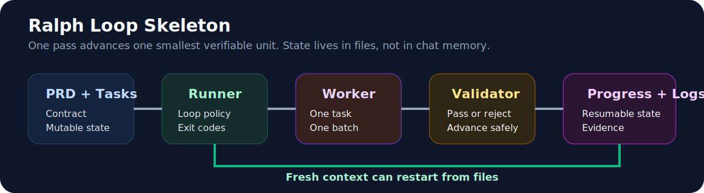

# Harness Engineer

<p align="center">
  
</p>

<p align="center">
  <a href="./README.zh-CN.md"><strong>简体中文</strong></a>
</p>

<p align="center">
  
  
  
  
  
</p>

<p align="center">
  <strong>Turn fragile prompt-driven workflows into recoverable, validator-first harness projects.</strong>
</p>

<p align="center">
  <a href="#overview">Overview</a> ·
  <a href="#quick-start">Quick Start</a> ·
  <a href="./CONTRIBUTING.md">Contributing</a> ·
  <a href="./ROADMAP.md">Roadmap</a> ·
  <a href="./RELEASING.md">Releasing</a>
</p>

## Overview

`harness-engineer` is a Codex skill for designing and scaffolding durable agent harness projects.

It is built for tasks that are:

- long-running
- repeatable
- multi-step
- high-stakes
- likely to span fresh-context restarts

Instead of treating the prompt as the whole system, the skill helps Codex:

- clarify the execution contract first
- choose the smallest safe topology
- separate stable docs from mutable machine state
- scaffold real project structure
- externalize resumable state
- add Ralph-style loop support when repeated passes are needed

## Project Status

- Current release: [`v0.1.2`](https://github.com/3109406559-code/harness-engineer-skill/releases/tag/v0.1.2)
- Stability: usable and validated for loop presets, runner variants, and project presets
- Scope: one production-ready skill, one rollback snapshot, and one scaffold helper
- Evolution model: doctrine-first updates, script updates second, skill trigger logic last

## Highlights

<table>
  <tr>
    <td width="33%">
      <strong>Harness Doctrine</strong><br>
      Encodes practical harness engineering principles distilled from OpenAI, Anthropic, Ralph, OpenHarness, and local practitioner notes.
    </td>
    <td width="33%">
      <strong>Scaffold Script</strong><br>
      Ships a Python helper that creates baseline or Ralph Loop harness projects with docs, logs, progress state, and validators.
    </td>
    <td width="33%">
      <strong>Ralph Loop Preset</strong><br>
      Generates a ready-to-customize loop skeleton with <code>PROMPT.md</code>, <code>tasks.json</code>, <code>progress.txt</code>, logs, archives, and a Ralph runner.
    </td>
    <td width="33%">
      <strong>Project Presets</strong><br>
      Adds task-family overlays for batch processing, repo coding, research collection, and UI validation without changing the core loop model.
    </td>
  </tr>
</table>

## Ralph Loop at a glance

<p align="center">
  
</p>

## Repository Layout

```text
harness-engineer-skill/
├── assets/
├── README.md
├── README.zh-CN.md
├── LICENSE
├── versions.json
├── skills/
│   └── harness-engineer/
│       ├── SKILL.md
│       ├── agents/openai.yaml
│       ├── references/
│       └── scripts/init_harness_project.py
└── snapshots/
    └── harness-engineer-backup-20260408-161519/
```

## Included Versions

| Version | Path | Notes |
|---|---|---|
| Current | [`skills/harness-engineer/`](./skills/harness-engineer/) | Active release with the Ralph Loop preset |
| Snapshot | [`snapshots/harness-engineer-backup-20260408-161519/`](./snapshots/harness-engineer-backup-20260408-161519/) | Backup from before the Ralph preset upgrade |

## Quick Start

### 1. Install the skill

<details>
<summary><strong>Windows PowerShell</strong></summary>

```powershell
Copy-Item -LiteralPath .\skills\harness-engineer -Destination "$HOME\.codex\skills\harness-engineer" -Recurse -Force
```

</details>

<details>
<summary><strong>macOS / Linux</strong></summary>

```bash
mkdir -p ~/.codex/skills
cp -R ./skills/harness-engineer ~/.codex/skills/harness-engineer
```

</details>

### 2. Invoke it explicitly

```text
Use $harness-engineer to clarify requirements and scaffold a robust harness project.
```

Typical prompts:

- `Use $harness-engineer to design a harness for a batch document-processing pipeline.`
- `Use $harness-engineer to refactor this prompt-only workflow into a recoverable harness.`
- `Use $harness-engineer to scaffold a Ralph Loop project for a multi-pass remediation task.`

## Scaffold Script

The skill includes a helper script:

[`skills/harness-engineer/scripts/init_harness_project.py`](./skills/harness-engineer/scripts/init_harness_project.py)

### Baseline scaffold

```powershell
python .\skills\harness-engineer\scripts\init_harness_project.py .\output --project-name "Example Harness"
```

### Ralph Loop scaffold

```powershell
python .\skills\harness-engineer\scripts\init_harness_project.py .\output --project-name "Example Ralph Harness" --preset ralph-loop
```

Useful flags:

- `--preset baseline|ralph-loop`
- `--project-preset generic|batch-processing|repo-coding|research-collection|ui-validation`
- `--topology`
- `--runner`
- `--batch-size`
- `--with-features-file`
- `--with-failure-log`
- `--with-archives`

## What the Skill Scaffolds

### Baseline mode

- `AGENTS.md`
- `config.yaml`
- `progress.txt`
- `docs/`
- `scripts/`
- validator placeholder
- summary placeholder

### Ralph Loop mode

- everything in baseline mode
- `PROMPT.md`
- `tasks.json`
- `docs/exec-plans/current-batch-plan.md`
- `logs/failure-log.jsonl`
- `archives/`
- a Ralph-style runner template

### Project preset overlays

- `generic`
- `batch-processing`
- `repo-coding`
- `research-collection`
- `ui-validation`

Project presets control the default shape of the work. Loop presets control how the work advances.

## Design Sources

This skill is an original synthesis shaped by:

- OpenAI harness engineering ideas
- Anthropic articles on long-running harnesses
- `snarktank/ralph`
- `HKUDS/OpenHarness`
- distilled local practitioner notes

It is not an official upstream release of any of those sources.

## Philosophy

> Better prompts help. Better harnesses survive.

The skill assumes:

- loops need externalized state
- validators matter more than optimistic self-reporting
- topology should stay as small as possible
- scaffolding should remain replaceable as models improve

## Attribution

- Human project owner and curator: repository maintainer
- AI implementation and packaging support: OpenAI Codex

This repository uses explicit README attribution for Codex. If you also want Codex-like attribution inside commit metadata, use a dedicated co-author trailer or bot/account identity in future commits.

## Validation

The current skill has been validated with:

- `quick_validate.py` against the skill itself
- Python compile checks for the scaffold script
- smoke tests for:
  - baseline scaffold generation
  - Ralph Loop scaffold generation
  - generated validator execution
  - generated runner execution
  - project preset overlays for all current task families

## Project Maintenance

- Contribution guide: [CONTRIBUTING.md](./CONTRIBUTING.md)
- Roadmap: [ROADMAP.md](./ROADMAP.md)
- Release process: [RELEASING.md](./RELEASING.md)

## License

MIT. See [LICENSE](./LICENSE).
