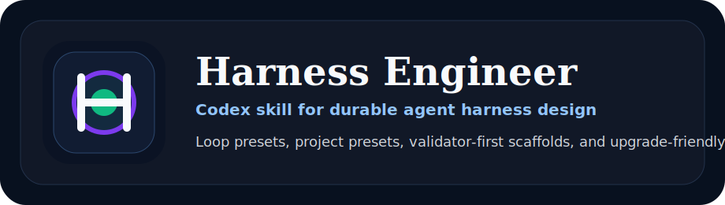
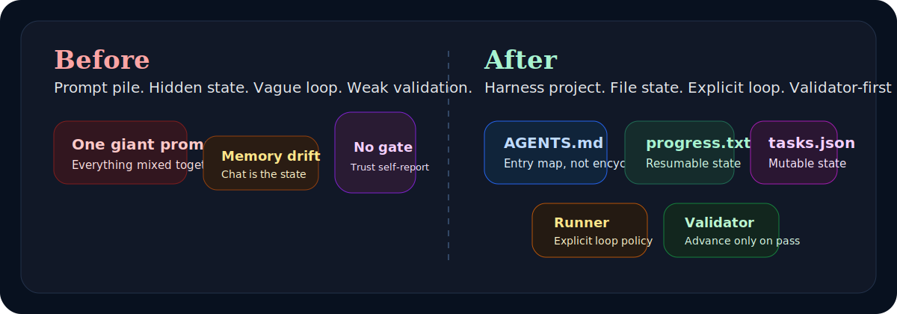
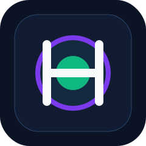
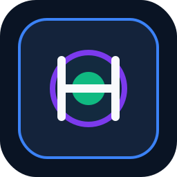
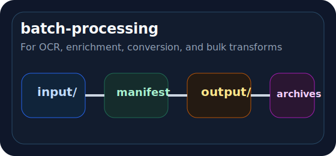
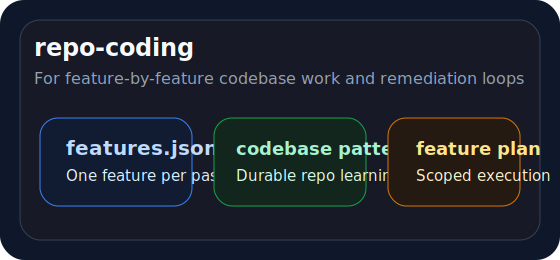
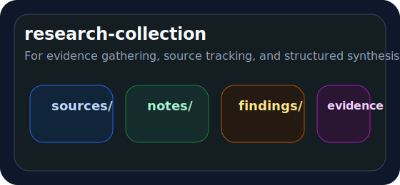
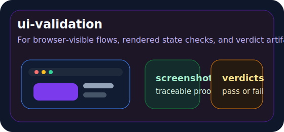

# Harness Engineer

<p align="center">
  
</p>

<p align="center">
  
</p>

<p align="center">
  <a href="./README.zh-CN.md"><strong>简体中文</strong></a>
</p>

<p align="center">
  
  
  
  
  
  
</p>

<p align="center">
  <strong>Turn prompt-heavy workflows into recoverable, validator-first harness projects with loop presets, task-family presets, and upgrade-friendly doctrine.</strong>
</p>

<p align="center">
  <a href="#why-it-matters">Why it matters</a> ·
  <a href="#before-vs-after">Before vs After</a> ·
  <a href="#how-it-works-in-3-steps">How it works</a> ·
  <a href="#what-you-get">What you get</a> ·
  <a href="#project-preset-gallery">Project Preset Gallery</a> ·
  <a href="#examples--use-cases">Examples</a> ·
  <a href="#quick-start">Quick Start</a> ·
  <a href="#decision-model">Decision Model</a> ·
  <a href="./CONTRIBUTING.md">Contributing</a> ·
  <a href="./ROADMAP.md">Roadmap</a> ·
  <a href="./RELEASING.md">Releasing</a>
</p>

## Why it matters

Most agent failures are not model failures. They are harness failures.

What actually breaks in practice:

- the execution contract is vague
- state lives only in chat memory
- a loop tries to do too much in one pass
- validation is weak or missing
- the scaffold is too generic for the real task

`harness-engineer` exists to fix that. It helps Codex design the harness before it improvises one.

## Before vs After

<p align="center">
  
</p>

The shift is the whole point of the project:

- **Before**: one giant prompt, hidden state, fuzzy boundaries, weak or missing validators
- **After**: explicit docs, file-based state, bounded loop passes, validator-first progression

## How it works in 3 steps

<table>
  <tr>
    <td width="33%">
      <strong>1. Freeze the contract</strong><br>
      Clarify inputs, outputs, success criteria, the smallest verifiable unit, and what counts as failure before scaffolding anything.
    </td>
    <td width="33%">
      <strong>2. Choose the shape</strong><br>
      Pick a loop preset for runtime behavior and a project preset for task-family structure.
    </td>
    <td width="33%">
      <strong>3. Generate and verify</strong><br>
      Scaffold files, externalize state, run validators, and leave behind a harness that survives fresh-context restarts.
    </td>
  </tr>
</table>

## What you get

<table>
  <tr>
    <td width="25%">
      <strong>Doctrine Layer</strong><br>
      Practical harness engineering guidance distilled from OpenAI, Anthropic, Ralph, OpenHarness, and hands-on local practice.
    </td>
    <td width="25%">
      <strong>Loop Presets</strong><br>
      Control how the harness runs: <code>baseline</code> for general scaffolds, <code>ralph-loop</code> for resumable multi-pass execution.
    </td>
    <td width="25%">
      <strong>Project Presets</strong><br>
      Control the work shape: batch processing, repo coding, research collection, or UI validation.
    </td>
    <td width="25%">
      <strong>Scaffold Engine</strong><br>
      A modular Python generator that emits docs, progress state, manifests, validators, and runner placeholders.
    </td>
  </tr>
</table>

## Visual identity

<p align="center">
  
  &nbsp;&nbsp;&nbsp;
  
</p>

The visual language mirrors the skill itself:

- deep blue for structure and systems
- green for validated forward motion
- violet for loop orchestration and preset logic
- amber for controlled evolution and caution points

## Architecture poster

<p align="center">
  
</p>

## Project Preset Gallery

<table>
  <tr>
    <td width="50%">
      
    </td>
    <td width="50%">
      
    </td>
  </tr>
  <tr>
    <td width="50%">
      
    </td>
    <td width="50%">
      
    </td>
  </tr>
</table>

## Examples / Use Cases

<details>
<summary><strong>Example 1: Batch OCR and enrichment</strong></summary>

Use:

```text
Use $harness-engineer to scaffold a Ralph Loop project for OCR and post-processing on a folder of scanned documents.
```

Suggested shape:

- `--preset ralph-loop`
- `--project-preset batch-processing`

What you get:

- bounded batch progression
- `tasks.json` for mutable unit state
- input/output/artifact directories
- archive-friendly structure for final outputs

</details>

<details>
<summary><strong>Example 2: Long-running code remediation</strong></summary>

Use:

```text
Use $harness-engineer to design a recoverable harness for fixing one codebase issue per pass.
```

Suggested shape:

- `--preset ralph-loop`
- `--project-preset repo-coding`

What you get:

- feature or task state
- codebase pattern memory
- scoped feature-plan docs
- runner + validator flow that supports incremental repair

</details>

<details>
<summary><strong>Example 3: Research collection and synthesis</strong></summary>

Use:

```text
Use $harness-engineer to scaffold a research harness that gathers sources, stores evidence, and synthesizes findings over multiple passes.
```

Suggested shape:

- `--preset baseline` or `--preset ralph-loop` depending on loop needs
- `--project-preset research-collection`

What you get:

- source manifest
- evidence and findings separation
- explicit research protocol
- structure that discourages mixing raw notes with validated output

</details>

<details>
<summary><strong>Example 4: UI work with browser evidence</strong></summary>

Use:

```text
Use $harness-engineer to scaffold a harness for browser-visible feature work with screenshot-based validation.
```

Suggested shape:

- `--preset ralph-loop`
- `--project-preset ui-validation`

What you get:

- screenshot, trace, and verdict directories
- UI validation reference doc
- stronger prompt guardrails around rendered-state evidence

</details>

## Project status

- Current public state: [`main`](https://github.com/3109406559-code/harness-engineer-skill/tree/main)
- Stability: validated across loop presets, runner variants, and all current project presets
- Scope: one current skill, one historical snapshot, one modular scaffold engine
- Evolution model: doctrine first, scaffold second, trigger text last

## Quick start

### 1. Install the skill

<details>
<summary><strong>Windows PowerShell</strong></summary>

```powershell
Copy-Item -LiteralPath .\skills\harness-engineer -Destination "$HOME\.codex\skills\harness-engineer" -Recurse -Force
```

</details>

<details>
<summary><strong>macOS / Linux</strong></summary>

```bash
mkdir -p ~/.codex/skills
cp -R ./skills/harness-engineer ~/.codex/skills/harness-engineer
```

</details>

### 2. Invoke the skill explicitly

```text
Use $harness-engineer to clarify requirements and scaffold a robust harness project.
```

Typical prompts:

- `Use $harness-engineer to design a harness for a batch document-processing pipeline.`
- `Use $harness-engineer to refactor this prompt-only workflow into a recoverable harness.`
- `Use $harness-engineer to scaffold a Ralph Loop project for a multi-pass remediation task.`

## Decision model

The skill has two independent control surfaces.

### Loop preset

This answers: **How should the harness run?**

| Loop preset | Use it when | Typical result |
|---|---|---|
| `baseline` | one scaffolded harness is enough and no explicit repeated loop policy is needed yet | simple runner, validator, docs, progress file |
| `ralph-loop` | work advances in repeated passes and must survive fresh-context restarts | `PROMPT.md`, `tasks.json`, batch plan, Ralph runner, loop contract |

### Project preset

This answers: **What shape should this work take?**

| Project preset | Best for | Adds |
|---|---|---|
| `generic` | task-agnostic scaffolds | no extra overlays |
| `batch-processing` | OCR, conversion, enrichment, bulk transforms | `input/`, `output/`, `artifacts/`, batch manifest, batch contract |
| `repo-coding` | incremental codebase work | `features.json`, codebase patterns, current feature plan |
| `research-collection` | source gathering and evidence synthesis | `sources/`, `notes/`, `findings/`, `evidence/`, source manifest |
| `ui-validation` | browser-visible work | `screenshots/`, `traces/`, `verdicts/`, UI verdict template |

## Scaffold script

The skill ships with a modular scaffold engine:

[`skills/harness-engineer/scripts/init_harness_project.py`](./skills/harness-engineer/scripts/init_harness_project.py)

### Example: baseline

```powershell
python .\skills\harness-engineer\scripts\init_harness_project.py .\output --project-name "Example Harness"
```

### Example: Ralph Loop + batch processing

```powershell
python .\skills\harness-engineer\scripts\init_harness_project.py .\output --project-name "Example Ralph Batch" --preset ralph-loop --project-preset batch-processing --batch-size 5
```

### Useful flags

- `--preset baseline|ralph-loop`
- `--project-preset generic|batch-processing|repo-coding|research-collection|ui-validation`
- `--topology`
- `--runner`
- `--batch-size`
- `--with-features-file`
- `--with-failure-log`
- `--with-archives`

## What gets generated

### Baseline scaffold

- `AGENTS.md`
- `config.yaml`
- `progress.txt`
- `docs/`
- `scripts/`
- validator placeholder
- summary placeholder

### Ralph Loop scaffold

- baseline scaffold
- `PROMPT.md`
- `tasks.json`
- `docs/exec-plans/current-batch-plan.md`
- `logs/failure-log.jsonl`
- `archives/`
- Ralph-style runner placeholder

### Task-family overlays

- `batch-processing`: batch manifest, pipeline dirs, archive bias
- `repo-coding`: feature state, codebase patterns, current feature plan
- `research-collection`: source manifest, evidence dirs, findings docs
- `ui-validation`: verdict template, screenshot and trace dirs

## Repository anatomy

```text
harness-engineer-skill/
├── assets/                 # landing-page visuals and icon system
├── skills/
│   └── harness-engineer/
│       ├── SKILL.md
│       ├── agents/openai.yaml
│       ├── references/     # doctrine and decision rules
│       └── scripts/        # modular scaffold generator
├── snapshots/              # rollback and historical comparison
├── README.md
├── README.zh-CN.md
├── CONTRIBUTING.md
├── ROADMAP.md
├── RELEASING.md
└── versions.json
```

## Included versions

| Version | Path | Notes |
|---|---|---|
| Current | [`skills/harness-engineer/`](./skills/harness-engineer/) | Active release with Ralph Loop and project presets |
| Snapshot | [`snapshots/harness-engineer-backup-20260408-161519/`](./snapshots/harness-engineer-backup-20260408-161519/) | Backup from before the Ralph preset upgrade |

## Design lineage

This repository is an original synthesis shaped by:

- OpenAI harness engineering ideas
- Anthropic articles on long-running harnesses
- `snarktank/ralph`
- `HKUDS/OpenHarness`
- distilled practitioner notes from real local use

It is not an official upstream release of any of those projects.

## Core thesis

> Better prompts help. Better harnesses survive.

The skill assumes:

- state should live in files, not chat memory
- validators matter more than optimistic self-reporting
- topology should stay as small as possible
- scaffolding should stay replaceable as models improve

## Validation

The current skill has been validated with:

- `quick_validate.py` against the skill itself
- Python compile checks for every scaffold module
- smoke tests for:
  - baseline scaffold generation
  - Ralph Loop scaffold generation
  - generated validator execution
  - generated Python, PowerShell, and Bash runners
  - all current project preset overlays

## Attribution

- Human project owner and curator: repository maintainer
- AI implementation and packaging support: OpenAI Codex

This repository uses explicit README attribution for Codex. If you also want Codex-like attribution inside commit metadata, use a dedicated co-author trailer or bot/account identity in future commits.

## Project maintenance

- Contribution guide: [CONTRIBUTING.md](./CONTRIBUTING.md)
- Roadmap: [ROADMAP.md](./ROADMAP.md)
- Release process: [RELEASING.md](./RELEASING.md)

## License

MIT. See [LICENSE](./LICENSE).
