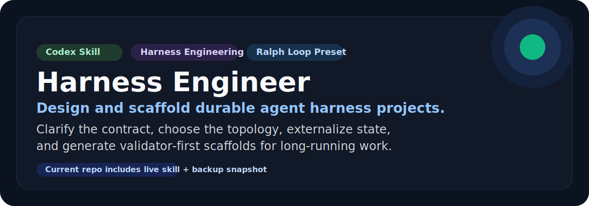
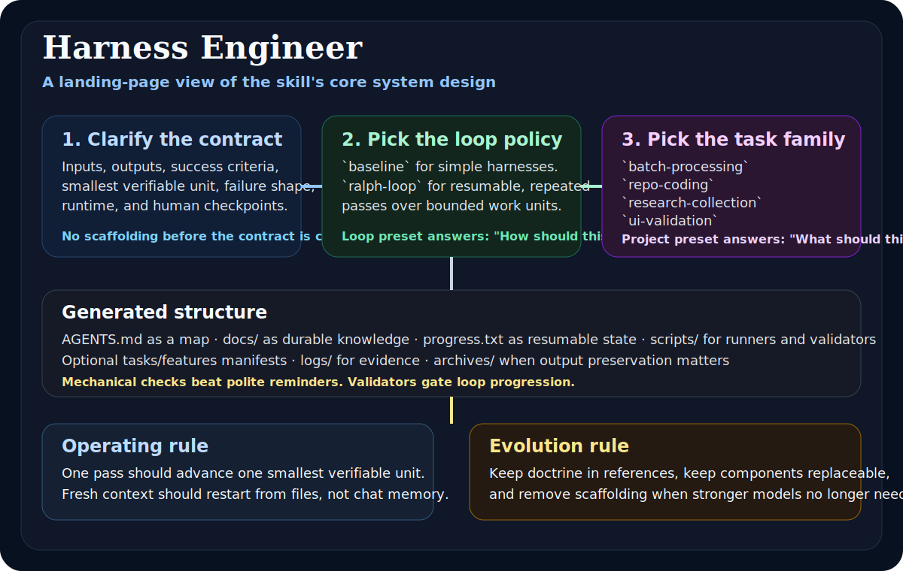

# Harness Engineer

<p align="center">
  
</p>

<p align="center">
  <a href="./README.md"><strong>English</strong></a>
</p>

<p align="center">
  
  
  
  
  
  
</p>

<p align="center">
  <strong>把 prompt 驱动的脆弱流程，升级成可恢复、可验证、可长期迭代的 harness 工程。</strong>
</p>

<p align="center">
  <a href="#为什么值得做">为什么值得做</a> ·
  <a href="#你会得到什么">你会得到什么</a> ·
  <a href="#快速开始">快速开始</a> ·
  <a href="#决策模型">决策模型</a> ·
  <a href="./CONTRIBUTING.md">贡献指南</a> ·
  <a href="./ROADMAP.md">路线图</a> ·
  <a href="./RELEASING.md">发布策略</a>
</p>

## 为什么值得做

很多 agent 失败，根本不是模型不够强，而是 harness 不够好。

真实问题通常是：

- 任务合同不清楚
- 状态只存在聊天上下文里
- 一轮里尝试做太多事
- 没有 validator 或 validator 太弱
- 脚手架太泛，和任务类型不匹配

`harness-engineer` 就是为这个问题而生。  
它的目标不是“再写一个大 prompt”，而是先帮 Codex 把系统搭对。

## 你会得到什么

<table>
  <tr>
    <td width="25%">
      <strong>Doctrine 层</strong><br>
      把 OpenAI、Anthropic、Ralph、OpenHarness 和本地实践里的方法论，蒸馏成可执行的 harness 设计规则。
    </td>
    <td width="25%">
      <strong>Loop Presets</strong><br>
      解决“怎么跑”：`baseline` 适合通用 harness，`ralph-loop` 适合多轮、可恢复、可中断的循环执行。
    </td>
    <td width="25%">
      <strong>Project Presets</strong><br>
      解决“跑什么类型的任务”：批处理、代码仓库、研究采集、UI 验证四类任务有各自默认骨架。
    </td>
    <td width="25%">
      <strong>Scaffold Engine</strong><br>
      一个模块化 Python 生成器，负责生成 docs、progress、manifest、validator 和 runner 占位模板。
    </td>
  </tr>
</table>

## Architecture Poster

<p align="center">
  
</p>

## 项目状态

- 当前版本：[`v0.1.2`](https://github.com/3109406559-code/harness-engineer-skill/releases/tag/v0.1.2)
- 当前状态：loop preset、runner 分支、project preset 已全部回归通过
- 当前范围：一个正式 skill、一个历史快照、一个模块化脚手架引擎
- 演进方式：先改 doctrine，再改 scaffold，最后才动触发逻辑

## 快速开始

### 1. 安装 skill

<details>
<summary><strong>Windows PowerShell</strong></summary>

```powershell
Copy-Item -LiteralPath .\skills\harness-engineer -Destination "$HOME\.codex\skills\harness-engineer" -Recurse -Force
```

</details>

<details>
<summary><strong>macOS / Linux</strong></summary>

```bash
mkdir -p ~/.codex/skills
cp -R ./skills/harness-engineer ~/.codex/skills/harness-engineer
```

</details>

### 2. 显式调用

```text
Use $harness-engineer to clarify requirements and scaffold a robust harness project.
```

典型请求：

- `Use $harness-engineer to design a harness for a batch document-processing pipeline.`
- `Use $harness-engineer to refactor this prompt-only workflow into a recoverable harness.`
- `Use $harness-engineer to scaffold a Ralph Loop project for a multi-pass remediation task.`

## 决策模型

这个 skill 有两个独立的控制面。

### 1. Loop preset

它回答的是：**这个 harness 应该怎么跑？**

| Loop preset | 适用场景 | 典型结果 |
|---|---|---|
| `baseline` | 先搭一个通用 harness，暂时不需要多轮 loop 策略 | 通用 runner、validator、docs、progress |
| `ralph-loop` | 工作需要一轮一轮推进，并且必须支持 fresh-context 重启 | `PROMPT.md`、`tasks.json`、batch plan、Ralph runner、循环退出约定 |

### 2. Project preset

它回答的是：**这类任务默认应该长什么样？**

| Project preset | 最适合 | 默认附加结构 |
|---|---|---|
| `generic` | 泛化 scaffold | 不附加额外结构 |
| `batch-processing` | OCR、转换、蒸馏、批量处理 | `input/`、`output/`、`artifacts/`、batch manifest、batch contract |
| `repo-coding` | 多轮代码改造、修复、功能推进 | `features.json`、codebase patterns、current feature plan |
| `research-collection` | 资料采集、证据收集、观点归纳 | `sources/`、`notes/`、`findings/`、`evidence/`、source manifest |
| `ui-validation` | 浏览器可见行为、前端验收 | `screenshots/`、`traces/`、`verdicts/`、UI verdict 模板 |

## 脚手架脚本

内置模块化脚手架引擎：

[`skills/harness-engineer/scripts/init_harness_project.py`](./skills/harness-engineer/scripts/init_harness_project.py)

### 示例：baseline

```powershell
python .\skills\harness-engineer\scripts\init_harness_project.py .\output --project-name "Example Harness"
```

### 示例：Ralph Loop + 批处理

```powershell
python .\skills\harness-engineer\scripts\init_harness_project.py .\output --project-name "Example Ralph Batch" --preset ralph-loop --project-preset batch-processing --batch-size 5
```

### 常用参数

- `--preset baseline|ralph-loop`
- `--project-preset generic|batch-processing|repo-coding|research-collection|ui-validation`
- `--topology`
- `--runner`
- `--batch-size`
- `--with-features-file`
- `--with-failure-log`
- `--with-archives`

## 它到底会生成什么

### Baseline scaffold

- `AGENTS.md`
- `config.yaml`
- `progress.txt`
- `docs/`
- `scripts/`
- validator 占位脚本
- summary 占位文件

### Ralph Loop scaffold

- baseline 全部内容
- `PROMPT.md`
- `tasks.json`
- `docs/exec-plans/current-batch-plan.md`
- `logs/failure-log.jsonl`
- `archives/`
- Ralph 风格 runner 占位模板

### 任务家族叠加层

- `batch-processing`：批次 manifest、输入输出目录、归档偏置
- `repo-coding`：feature 状态、codebase patterns、当前 feature plan
- `research-collection`：source manifest、证据目录、findings 文档
- `ui-validation`：verdict 模板、截图目录、trace 目录

## 仓库结构

```text
harness-engineer-skill/
├── assets/                 # GitHub 首页视觉资源
├── skills/
│   └── harness-engineer/
│       ├── SKILL.md
│       ├── agents/openai.yaml
│       ├── references/     # doctrine 与决策规则
│       └── scripts/        # 模块化脚手架引擎
├── snapshots/              # 回滚点与历史版本
├── README.md
├── README.zh-CN.md
├── CONTRIBUTING.md
├── ROADMAP.md
├── RELEASING.md
└── versions.json
```

## 包含版本

| 版本 | 路径 | 说明 |
|---|---|---|
| 当前正式版 | [`skills/harness-engineer/`](./skills/harness-engineer/) | 已包含 Ralph Loop 与 project presets |
| 历史快照 | [`snapshots/harness-engineer-backup-20260408-161519/`](./snapshots/harness-engineer-backup-20260408-161519/) | 加入 Ralph preset 之前的备份版本 |

## 理念来源

这个 skill 是一个独立 synthesis，不是任何单一上游项目的官方下游发布。它的思想主要来自：

- OpenAI 的 Harness Engineering
- Anthropic 关于长任务 harness 的文章
- `snarktank/ralph`
- `HKUDS/OpenHarness`
- 本地真实使用过程中的实践蒸馏

## 核心主张

> 更强的 prompt 有帮助，但更好的 harness 才能真正长期存活。

这个 skill 默认相信：

- 长任务一定要把状态外置
- validator 比“感觉差不多了”更重要
- 拓扑应该尽量小
- 模型变强之后，脚手架应该允许被删减，而不是只会继续堆

## 已做验证

当前版本已经通过：

- `quick_validate.py` 对 skill 的基础校验
- 所有 scaffold 模块的 Python 编译检查
- 以下 smoke test：
  - baseline scaffold 生成
  - Ralph Loop scaffold 生成
  - 生成后的 validator 执行
  - 生成后的 Python / PowerShell / Bash runner 执行
  - 所有 project preset 叠加路径

## Attribution

- 人类项目拥有者与维护者：仓库维护者
- AI 实现与打包协助：OpenAI Codex

目前采用 README 显式署名来标记 Codex 参与。如果后面你还想把这种归属延伸到提交历史，可以在后续 commit 中加入 co-author trailer，或者使用专门的 bot / 账号身份。

## 项目维护

- 贡献指南：[CONTRIBUTING.md](./CONTRIBUTING.md)
- 路线图：[ROADMAP.md](./ROADMAP.md)
- 发布策略：[RELEASING.md](./RELEASING.md)

## License

MIT，见 [LICENSE](./LICENSE)。
